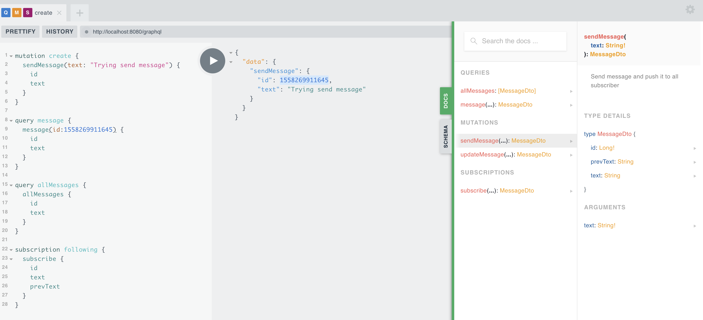

# java-graphql

Simple API for sending and retrieve a message using GraphQL in Java

### Framework & Library
1. spring-boot 2
2. reactor-core
3. graphql-spqr

### Prerequisites

[JDK 8](http://www.oracle.com/technetwork/java/javase/downloads/jdk8-downloads-2133151.html)

### Running the project

```
./mvnw clean package spring-boot:run
```

### Access the API and Documentation
```
http://localhost:8080/gui
```



### Example Query

* Sending message
```
mutation create {
  sendMessage(text: "Trying send message") {
    id
    text
  }
}

```

* Retrieve message
```
query message {
  message(id:1558267484475) {
    id
    text
  }
}}
```

* Collect all message 
```
query allMessages {
  allMessages {
    id
    text
  }
}
```

* Collect message realtime
```
subscription following {
  subscribe {
    id
    text
    prevText
  }
}
```
